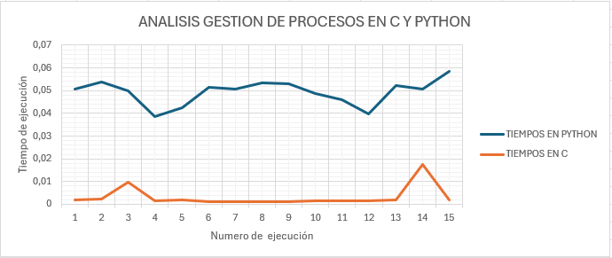

# Parcial-Sistemas-Operativos-Corte-2

## INTEGRANTES

*   David Arias Rueda
*   Juan David Carvajal Lozano
*   Paula Andrea Gómez Aldana

# PARCIAL 2

## GUIA DE EJECUCION DE LOS PROGRAMAS

### Instrucciones

#### Programa en C PRIORIDAD.C
1. Navega a la carpeta que contiene el código fuente en C: `cd ruta/al/codigo/en/c`
2. Compila el programa: `gcc -o nombre_ejecutable nombre_archivo.c`
3. Ejecuta el programa compilado: `./nombre_ejecutable`

#### Programa en Python PRIORIDAD.PY
1. Asegúrate de tener Python 3 instalado
2. Navega a la carpeta que contiene el código en Python: `cd ruta/al/codigo/en/python`
3. Ejecuta el script de Python: `python3 nombre_script.py`

#### Programa en C MEDIRTIME.C
1. Navega a la carpeta que contiene el código fuente en C: `cd ruta/al/codigo/en/c`
2. Compila el programa: `gcc -o nombre_ejecutable nombre_archivo.c`

Si el programa a ejecutar es en c:
3. Ejecuta el programa compilado: `./nombre_ejecutable ./nombre_del_compilado_del_archivo_en_c`

Si el programa a ejecutar es en python:
3. Ejecuta el programa compilado: `./nombre_ejecutable python3 nombre_script.py`

### Uso
- El programa medirTime.c sirve para medir el tiempo de ejecucion de los programas prioridad.c y prioridad.py
- El programa prioridad.c gestiona 90 procesos que se distribuyen en tres diferentes colas y si estas se encuentran llenas, lo agrega a una lista de espera
- El programa prioridad.py gestiona 90 procesos que se distribuyen en tres diferentes colas y si estas se encuentran llenas, lo agrega a una lista de espera

## PROBLEMA

### Planificación por Prioridades Dinámicas:

Implementar un algoritmo de planificación que permita a los procesos cambiar dinámicamente sus prioridades en función de su comportamiento y estado. La implementación puede debe ser en Python y en C.

Ejemplo, se podría usar el algoritmo de planificación de retroalimentación multinivel (MLFQ) donde los procesos se mueven entre colas con diferentes prioridades en función de su tiempo de CPU utilizado.

### Recomendación:

Para implementar un algoritmo de planificación con prioridades dinámicas, se necesita una forma de calcular y ajustar las prioridades de los procesos en función de su comportamiento. Por ejemplo, se podría aumentar la prioridad de un proceso si ha esperado mucho tiempo en la cola de listos, o reducir su prioridad si ha utilizado una gran cantidad de tiempo de CPU recientemente. (Se adjunta modelo).

## SOLUCIÓN

### Programa en C

Este programa se ejecutó 15 veces con el fin de tomar su tiempo de ejecución y hacer un análisis más específico, los siguientes son los tiempos de ejecución:

### Programa en Python

Este programa se ejecutó 15 veces con el fin de tomar su tiempo de ejecución y hacer un análisis más específico, los siguientes son los tiempos de ejecución:

### Análisis entre tiempos de ejecución en la gestión de procesos, según el lenguaje de programación (C y Python)

Teniendo en cuenta la gráfica anterior se evidencia que los tiempos de ejecución presentados en Python son más altos que los presentados en C, esto puede deberse a que Python es un lenguaje de programación interpretado, a diferencia de C que es un lenguaje de programación compilado, lo que afecta directamente a su tiempo de ejecución.
